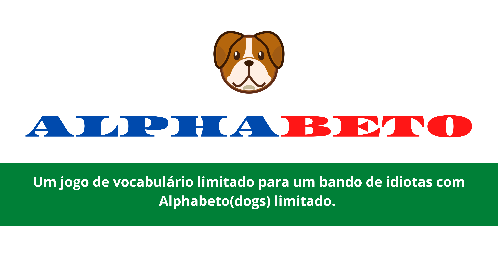

# Alphabeto - um jogo diário de adivinhar palavras

O [**Alphabeto**](https://alphabeto.herokuapp.com/) é um jogo web de adivinhação de palavras, criado como uma versão brasileira não-oficial do [Wordle](https://www.powerlanguage.co.uk/wordle/). Este projeto foi feito através de um Fork do projeto do [**Gabriel Toshi**](https://www.gabtoschi.com/letreco/) Todos os dias, todos os jogadores que entram no site tem uma palavra de 5 letras para descobrir usando até 6 tentativas. As palavras deste jogo são derivadas do universo de palavras do grupo de amigos "Alphadogs". Cada tentativa deve ser uma palavra válida e o jogo dá dicas a partir destes chutes, falando quais letras não estão na palavra ou se elas estão na posição correta na palavra.
